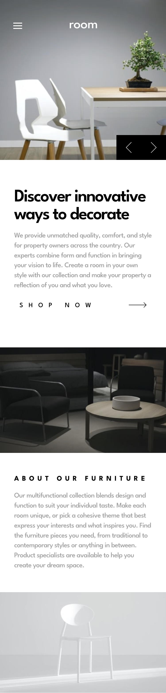
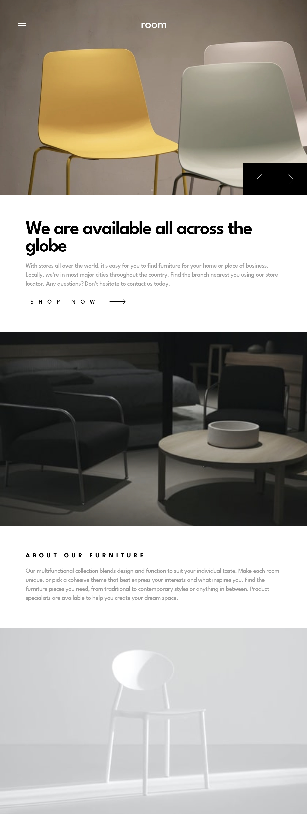
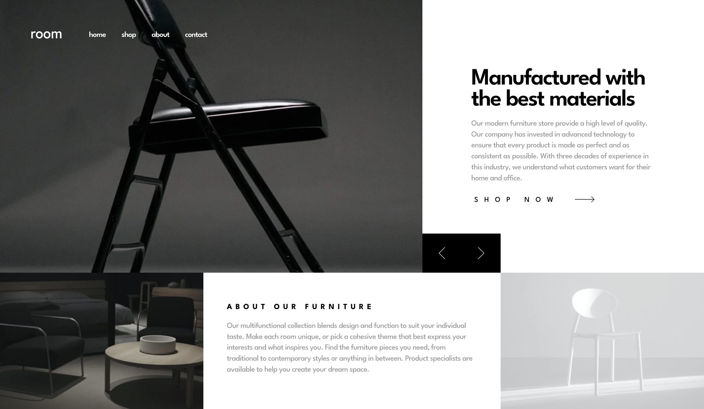

# Frontend Mentor - Room homepage solution

This is a solution to the [Room homepage challenge on Frontend Mentor](https://www.frontendmentor.io/challenges/room-homepage-BtdBY_ENq). Frontend Mentor challenges help you improve your coding skills by building realistic projects.

## Table of contents

- [Overview](#overview)
  - [The challenge](#the-challenge)
  - [Screenshot](#screenshot)
  - [Links](#links)
- [My process](#my-process)
  - [Built with](#built-with)
  - [What I learned](#what-i-learned)
  - [Continued development](#continued-development)
  - [Useful resources](#useful-resources)
- [Author](#author)

## Overview

### The challenge

Users should be able to:

- View the optimal layout for the site depending on their device's screen size
- See hover states for all interactive elements on the page
- Navigate the slider using either their mouse/trackpad or keyboard

### Screenshot

  
Mobile Screenshot

  
  

  
Tablet Screenshot

  
  

  
Desktop Screenshot

  
  

### Links

- [Github Repo](https://github.com/s2i61m97o/fm-room-homepage)
- [Live Site](https://s2i61m97o.github.io/fm-room-homepage)

## My process

### Built with

- Semantic HTML5 markup
- CSS custom properties
- Flexbox
- CSS Grid
- SASS
- Mobile-first workflow
- [React](https://reactjs.org/)

### What I learned

How elements are laid out needs to be carefully considered when using CSS transitions. I had to overhaul a lot of my original layout CSS when I was trying to animate the hero images and text as it would not work correctly otherwise. Originally I was conditionally rendering the images and text depending on state (which was basically a slide number). I had to change this to render all the images and text and just translate them of the screen, sliding them back on the screen when needed.  

### Continued development

I will continue to look at using CSS transitions and animations in appropriate places within future projects, as well as thinking about how I am going to implement them whilst dealing with layout, so as not to have to overhaul sections again. 
After finding the below Kevin Powell video on underused CSS features, I will also look deeper into CSS Grid and its capabilities.

### Useful resources

- [3 underused CSS Grid Features](https://youtube.com/watch?v=ciuZJE74wBA) Kevin Powell YouTube video

## Author

- Frontend Mentor - [@s2i61m97o](https://www.frontendmentor.io/profile/s2i61m97o)
- Twitter - [@mattyjsimmo](https://www.twitter.com/mattyjsimmo)
